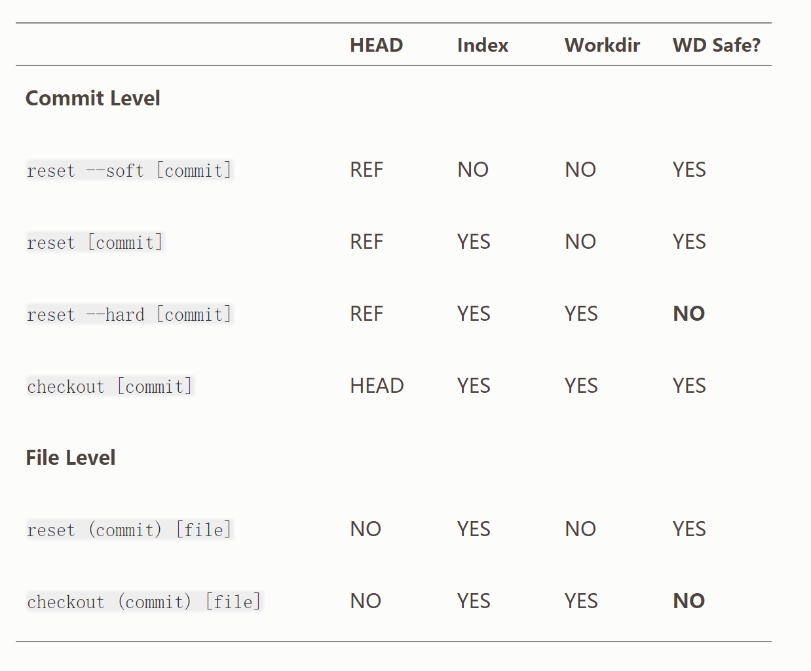

## 概述
1. 撤销上一次提交

```
git reset --soft HEAD~
```

2. 撤销一上次 提交，并`取消暂存`所有的东西

```
git reset [--mixed] HEAD~
```

3. 撤销最后的提交、git add 和 git commit 命令以及工作目录中的所有工作。

```
git reset --hard HEAD~
```


## 第 1 步：移动 HEAD
```
git reset --soft HEAD~
```
`它本质上是撤销了上一次 git commit 命令。` 当你在运行 git commit 时，Git 会创建一个新的提交，并移动 HEAD 所指向的分支来使其指向该提交。 当你将它 reset 回 HEAD~（HEAD 的父结点）时，其实就是把该分支移动回原来的位置，而不会改变索引和工作目录。 现在你可以更新索引并再次运行 git commit 来完成 git commit --amend 所要做的事情了,如下图，


备注：它将包含从HEAD～开始之后的所有修改。(用途之一：压缩提交，即将多个commit信息合并为一笔)

## 第 2 步：更新索引（--mixed）
`git reset [--mixed] HEAD~`
它依然会撤销一上次 提交，但还会 取消暂存 所有的东西。 于是，我们回滚到了所有 git add 和 git commit 的命令执行之前。


## 第 3 步：更新工作目录（--hard）
`git reset --hard HEAD~`
你撤销了最后的提交、git add 和 git commit 命令以及工作目录中的所有工作。


必须注意，--hard 标记是 reset 命令唯一的危险用法，它也是 Git 会真正地销毁数据的仅有的几个操作之一。 其他任何形式的 reset 调用都可以轻松撤消，但是 --hard 选项不能，因为它强制覆盖了工作目录中的文件。

## 通过路径来重置
前面讲述了 reset 基本形式的行为，不过你还可以给它提供一个作用路径。 若指定了一个路径，reset 将会跳过第 1 步，并且将它的作用范围限定为指定的文件或文件集合。 这样做自然有它的道理，因为 HEAD 只是一个指针，你无法让它同时指向两个提交中各自的一部分。 不过索引和工作目录 可以部分更新，所以重置会继续进行第 2、3 步。

现在，假如我们运行 git reset file.txt （这其实是 git reset --mixed HEAD file.txt 的简写形式，因为你既没有指定一个提交的 SHA-1 或分支，也没有指定 --soft 或 --hard），它会：

1, 移动 HEAD 分支的指向 （已跳过）
2, 让索引看起来像 HEAD （到此处停止）

`所以它本质上只是将 file.txt 从 HEAD 复制到索引中。`


它还有` 取消暂存文件 `的实际效果。 如果我们查看该命令的示意图，然后再想想 git add 所做的事，就会发现它们正好相反。

我们可以不让 Git 从 HEAD 拉取数据，而是通过具体指定一个提交来拉取该文件的对应版本。 我们只需运行类似于 git reset eb43bf file.txt 的命令即可。


它其实做了同样的事情，也就是把工作目录中的文件恢复到 v1 版本，运行 git add 添加它，然后再将它恢复到 v3 版本（只是不用真的过一遍这些步骤）。 `如果我们现在运行 git commit，它就会记录一条“将该文件恢复到 v1 版本”的更改，尽管我们并未在工作目录中真正地再次拥有它。`

## 压缩
我们来看看如何利用这种新的功能来做一些有趣的事情 - `压缩提交`。

假设你的一系列提交信息中有 “oops.”、“WIP” 和 “forgot this file”， 聪明的你就能使用 reset 来轻松快速地将它们压缩成单个提交，也显出你的聪明。 （压缩提交 展示了另一种方式，不过在本例中用 reset 更简单。）

假设你有一个项目，第一次提交中有一个文件，第二次提交增加了一个新的文件并修改了第一个文件，第三次提交再次修改了第一个文件。 由于第二次提交是一个未完成的工作，因此你想要压缩它。


那么可以运行` git reset --soft HEAD~2 `来将 HEAD 分支移动到一个旧一点的提交上（即你想要保留的第一个提交）：


然后只需再次运行 git commit：


现在你可以查看可到达的历史，即将会推送的历史，现在看起来有个 v1 版 file-a.txt 的提交，接着第二个提交将 file-a.txt 修改成了 v3 版并增加了 file-b.txt。 包含 v2 版本的文件已经不在历史中了。

## 总结
希望你现在熟悉并理解了 reset 命令，不过关于它和 checkout 之间的区别，你可能还是会有点困惑，毕竟不太可能记住不同调用的所有规则。

下面的速查表列出了命令对树的影响。 “HEAD” 一列中的 “REF” 表示该命令移动了 HEAD 指向的分支引用，而`‘HEAD’' 则表示只移动了 HEAD 自身。 特别注意 WD Safe? 一列 - 如果它标记为 NO，那么运行该命令之前请考虑一下。


参考：[重置](https://git-scm.com/book/zh/v2/Git-%E5%B7%A5%E5%85%B7-%E9%87%8D%E7%BD%AE%E6%8F%AD%E5%AF%86)
