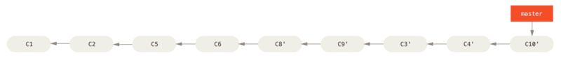

在 Git 中整合来自不同分支的修改主要有两种方法：merge 以及 rebase。

步骤(1.1和1.2有冲突的时候才需要）：
 1. git rebase [basebranch] [topicbranch] [-i]

    1.1. fix conflict if it exists
    
    1.2. resolve the confilct with `git add`

 2. git checkout [basebranch]
 3. git merge [topicbranch]
 4. git branch -d [topicbranch]

`tips`:[-i]交互方式，推荐!

示例：


你决定将 server 分支中的修改整合到主分支。 使用 git rebase [basebranch] [topicbranch] 命令可以直接将特性分支（即本例中的 server）变基到目标分支（即 master）上。这样做能省去你先切换到 server 分支，再对其执行变基命令的多个步骤。

```
$ git rebase master server
```

如图 `将 server 中的修改变基到 master 上` 所示，server 中的代码被“续”到了 master 后面。


然后就可以快进合并主分支 master 了：
```
$ git checkout master
$ git merge server
```

至此，client 和 server 分支中的修改都已经整合到主分支里了，你可以删除这两个分支，最终提交历史会变成图`最终的提交历史`中的样子：

```
$ git branch -d client
$ git branch -d server
```



## 变基的风险
呃，奇妙的变基也并非完美无缺，要用它得遵守一条准则：

`不要对在你的仓库外有副本的分支执行变基。`

如果你遵循这条金科玉律，就不会出差错。 否则，人民群众会仇恨你，你的朋友和家人也会嘲笑你，唾弃你。

变基操作的实质是丢弃一些现有的提交，然后相应地新建一些内容一样但实际上不同的提交。 
`*如果你已经将提交推送至某个仓库，而其他人也已经从该仓库拉取提交并进行了后续工作，此时，如果你用 git rebase 命令重新整理了提交并再次推送，*`
你的同伴因此将不得不再次将他们手头的工作与你的提交进行整合，如果接下来你还要拉取并整合他们修改过的提交，事情就会变得一团糟。


参考：[变基](https://git-scm.com/book/zh/v2/Git-%E5%88%86%E6%94%AF-%E5%8F%98%E5%9F%BA)
