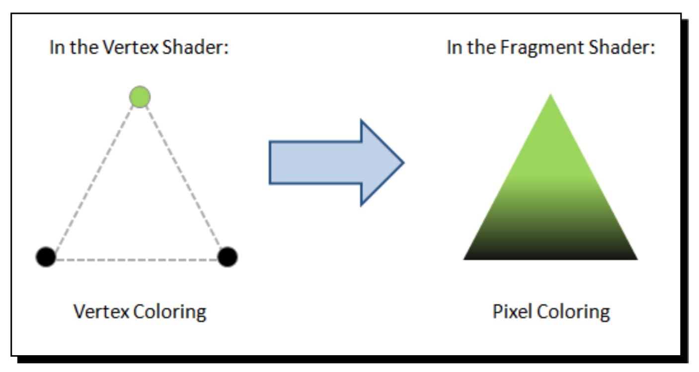
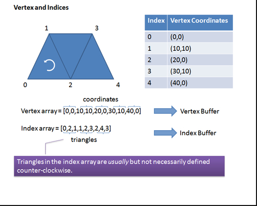

## Vertices and Indices
有两种数据类型是表示任何3D对象几何的基础：顶点和索引。
- Vertices：顶点是定义3D对象角落的点。每个顶点由对应于顶点的x，y和z坐标的三个浮点数表示。
- Indices：索引是给定3D场景中顶点的数字标签。索引允许我们告诉WebGL如何连接顶点以产生曲面。就像顶点一样，索引存储在JavaScript数组中，然后使用WebGL索引缓冲区将其传递给WebGL的渲染管道。

>有两种用于描述和处理几何的WebGL缓冲区：包含顶点数据的缓冲区称为顶点缓冲区对象（VBO）。类似地，包含索引数据的缓冲区称为索引缓冲区对象（IBO）。

VBO包含WebGL需要描述要呈现的几何的数据。如引言所述，顶点坐标通常在WebGL中存储和处理为VBO。此外，还有几个数据元素，如顶点法线，颜色和纹理坐标等，可以建模为VBO。

## Vertex shader
在每个顶点调用顶点着色器。该着色器操纵每个顶点数据，例如顶点坐标，法线，颜色和纹理坐标。该数据由顶点着色器内的属性表示。每个属性指向从其读取顶点数据的VBO。

## Fragment shader
每组三个顶点定义一个三角形，并且该三角形表面上的每个元素需要分配一个颜色。否则我们的表面将是透明的。

每个表面元素称为片段。由于我们正在处理将要显示在屏幕上的曲面，所以这些元素通常被称为像素。

片段着色器的主要目标是计算单个像素的颜色。下图解释了这个想法：


## Framebuffer
它是一个二维缓冲区，包含片段着色器处理的片段。一旦所有碎片都被处理完毕，就会形成2D图像并显示在屏幕上。帧缓冲区是渲染管道的最终目的地。

## Attributes, uniforms, and varyings
Attributes, uniforms, and varyings are the three different types of variables that you will find when programming with shaders.
属性，制服和变化是使用着色器编程时您会发现的三种不同类型的变量。

`属性`是在顶点着色器中使用的输入变量。例如，顶点坐标，顶点颜色等。由于在每个顶点上调用顶点着色器的事实，每次调用顶点着色器时，属性将不同。

`uniforms`是可用于顶点着色器和片段着色器的输入变量。与属性不同，uniforms在渲染循环中是不变的。例如，灯位置。

`varyings`用于将数据从顶点着色器传递到片段着色器。

## Rendering geometry in WebGL
以下是我们将在以下步骤中在WebGL中呈现一个对象的步骤:
- 首先，我们将使用JavaScript数组定义几何。
- 其次，我们将创建各自的WebGL缓冲区。
- 第三，我们将把顶点着色器属性指向我们在上一步中创建的用于存储顶点坐标的VBO。
- 最后，我们将使用IBO来执行渲染。

## Defining a geometry using JavaScript arrays
让我们看看我们需要做什么来创建梯形。我们需要两个JavaScript数组：一个用于顶点，一个用于索引。


从上一个屏幕截图可以看出，我们已经将坐标顺序放置在顶点数组中，然后我们在索引数组中指出了如何使用这些坐标来绘制梯形图。因此，第一个三角形由具有索引0,1和2的顶点形成;具有索引1,2和3的顶点的第二个;最后，第三个，顶点的索引为2,3和4.对于所有可能的几何，我们将遵循相同的过程。

## Creating WebGL buffers
在这种情况下，我们在x-y平面上有一个简单的正方形（对于所有四个顶点，z坐标为零）：
```
var vertices = [-50.0, 50.0, 0.0,
-50.0,-50.0, 0.0,
50.0,-50.0, 0.0,
50.0, 50.0, 0.0];/* our JavaScript vertex array */
var myBuffer = gl.createBuffer(); /*gl is our WebGL Context*/

```

在上一章中，您可能会记得WebGL作为状态机运行。现在，当myBuffer成为当前绑定的WebGL缓冲区时，这意味着任何后续的缓冲区操作将在此缓冲区上执行，直到它被解除绑定，或者另一个缓冲区成为当前绑定调用的缓冲区。我们使用以下指令绑定一个缓冲区：
```
gl.bindBuffer(gl.ARRAY_BUFFER, myBuffer);
```
第一个参数是我们正在创建的缓冲区的类型。我们有两个参数选项：
- gl.ARRAY_BUFFER: Vertex data
- gl.ELEMENT_ARRAY_BUFFER: Index data

一旦我们绑定了一个缓冲区，我们需要传递它的内容。我们用bufferData函数做这个：
```
gl.bufferData(gl.ARRAY_BUFFER，new Float32Array(vertices),gl.STATIC_DRAW);
```

在这个例子中，顶点变量是一个包含顶点坐标的JavaScript数组。 WebGL不直接接受JavaScript数组作为bufferData方法的参数。相反，WebGL使用类型化的数组，以便缓冲区数据可以以其本机二进制形式进行处理，目的是加快几何处理性能。

最后，解除缓冲区是一个很好的做法。我们可以通过调用以下指令来实现：
```
gl.bindBuffer（gl.ARRAY_BUFFER，null）;
```

We will repeat the same calls described here for every WebGL buffer (VBO or IBO) that we will use.
Let's review what we have just learned with an example. We are going to code the initBuffers function to create the VBO and IBO for a cone. (You will find this function in the file named ch2_Cone.html):

```js
var coneVBO = null; //Vertex Buffer Object
var coneIBO = null; //Index Buffer Object
function initBuffers() {
var vertices = []; //JavaScript Array that populates coneVBO
var indices = []; //JavaScript Array that populates coneIBO;
//Vertices that describe the geometry of a cone
vertices =[1.5, 0, 0,
-1.5, 1, 0,
-1.5, 0.809017, 0.587785,
-1.5, 0.309017, 0.951057,
-1.5, -0.309017, 0.951057,
-1.5, -0.809017, 0.587785,
-1.5, -1, 0.0,
-1.5, -0.809017, -0.587785,
-1.5, -0.309017, -0.951057,
-1.5, 0.309017, -0.951057,
-1.5, 0.809017, -0.587785];
//Indices that describe the geometry of a cone
indices = [0, 1, 2,
0, 2, 3,
0, 3, 4,
0, 4, 5,
0, 5, 6,
0, 6, 7,
0, 7, 8,
0, 8, 9,
0, 9, 10,
0, 10, 1];
coneVBO = gl.createBuffer();
gl.bindBuffer(gl.ARRAY_BUFFER, coneVBO);
gl.bufferData(gl.ARRAY_BUFFER, new Float32Array(vertices),
gl.STATIC_DRAW);
gl.bindBuffer(gl.ARRAY_BUFFER, null);
coneIBO = gl.createBuffer();
gl.bindBuffer(gl.ELEMENT_ARRAY_BUFFER, coneIBO);
gl.bufferData(gl.ELEMENT_ARRAY_BUFFER, new Uint16Array(indices),
gl.STATIC_DRAW);
gl.bindBuffer(gl.ELEMENT_ARRAY_BUFFER, null);
}
```

To summarize, for every buffer, we want to:
- Create a new buffer
- Bind it to make it the current buffer
- Pass the buffer data using one of the typed arrays
- Unbind the buffer

## The drawArrays and drawElements functions

函数drawArrays和drawElements用于写入帧缓冲区（framebuffer）。
drawArrays以缓冲区中定义的顺序使用顶点数据来创建几何。相反，drawElements使用索引来访问顶点数据缓冲区并创建几何。

### Using drawArrays
当有关索引的信息不可用时，我们将调用drawArrays。在大多数情况下，当几何体如此简单，使用drawArrays来定义索引是一个过度的;例如，当我们要渲染一个三角形或一个矩形时。在这种情况下，WebGL将按照VBO中定义顶点坐标的顺序创建几何。所以如果你有连续的三角形（就像我们的梯形例子），你必须在VBO中重复这些坐标。

### Using drawElements
与以前没有定义IBO的情况不同，drawElements允许我们使用IBO来告诉WebGL如何渲染几何。记住drawArrays使用VBO。这意味着顶点着色器将处理重复的顶点，使其在VBO中显示多次。相反，drawElements使用索引。因此，顶点仅被处理一次，并且可以使用它们在IBO中定义的次数。此功能可以减少GPU上所需的内存和处理。

当我们使用drawElements时，我们至少需要两个缓冲区：一个VBO和一个IBO。顶点着色器将在VBO中的每个顶点执行，然后渲染管线将使用IBO将几何体组装成三角形。

>当drawElements被调用时，它使用来自启用数组的计数顺序元素，从偏移开始构造几何图元序列。 Mode指定了什么样的基元被构造，以及数组元素如何构造这些基元。如果启用了多个数组，则使用每个数组