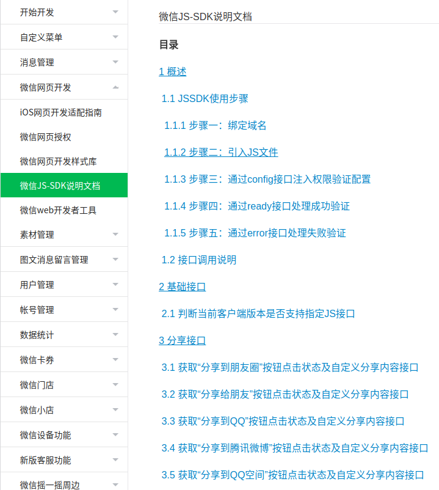
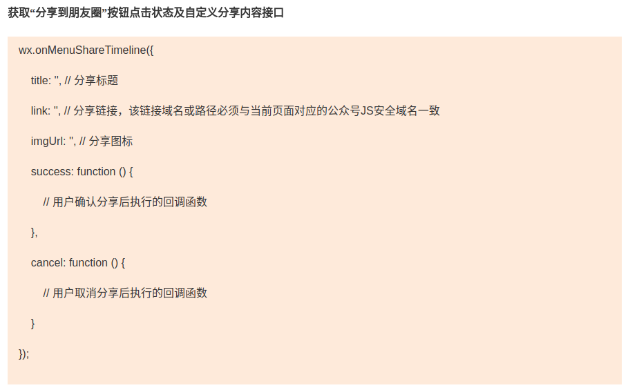
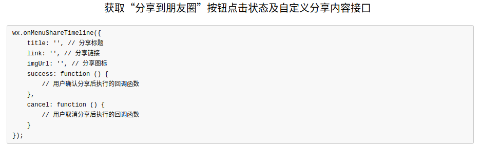
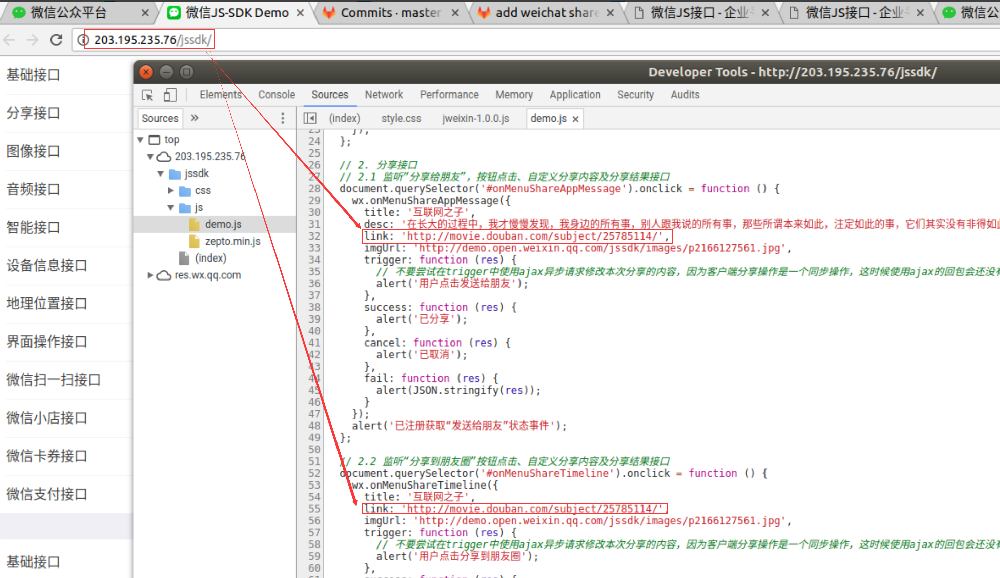

# 前提条件

1. 实名认证的微信公众号
2. 工信部备案过的域名
3. 云服务器

# 开发

打开[微信JS-SDK说明文档][1]，根据步骤一，二，三，四，五。如下图所示：

进行到[`获取“分享到朋友圈”按钮点击状态及自定义分享内容接口`][1]中的3.1节的时候，因参考的是 *[假文档][_3.1]* (同样出自微信团队），

**真文档** 如下：

*[假文档][_3.1]* 如下：

> 当时参照了[假文档][_1]，直接拷贝了[假文档的代码][gitlab], 掉进了第一个坑。

# 问题

按照[假文档][_1]开发完之后，发现[`微信开发者工具`][wechat-tool]和`Android`是可以正常自定义分享的。但iOS下死活不起作用。

# 问题排查

排查问题的时候，是参照[真文档][1]了, 主要详细阅读`附录5-常见错误及解决方法`部分了，主要有如下几点：

调用config 接口的时候传入参数 debug: true 可以开启debug模式，页面会alert出错误信息。以下为常见错误及解决方法：

1. invalid url domain当前页面所在域名与使用的appid没有绑定，请确认正确填写绑定的域名，仅支持 **`80（http）和443（https）`** 两个端口，因此不需要填写端口号（一个appid可以绑定三个有效域名，见 目录1.1.1）。

2. invalid signature签名错误。建议按如下顺序检查：

   1.确认签名算法正确，可用 http://mp.weixin.qq.com/debug/cgi-bin/sandbox?t=jsapisign 页面工具进行校验。

   2.确认config中nonceStr（js中驼峰标准大写S）, timestamp与用以签名中的对应noncestr, timestamp一致。

   3.确认url是页面完整的url(请在当前页面alert(location.href.split('#')[0])确认)，包括'http(s)://'部分，以及'？'后面的GET参数部分,但不包括'#'hash后面的部分。

   4.确认 config 中的 appid 与用来获取 jsapi_ticket 的 appid 一致。

   5.确保一定缓存access_token和jsapi_ticket。

   6.确保你获取用来签名的url是动态获取的，动态页面可参见实例代码中php的实现方式。如果是html的静态页面在前端通过ajax将url传到后台签名，前端需要用js获取当前页面除去'#'hash部分的链接（可用location.href.split('#')[0]获取,而且需要encodeURIComponent），因为页面一旦分享，微信客户端会在你的链接末尾加入其它参数，如果不是动态获取当前链接，将导致分享后的页面签名失败。

3. the permission value is offline verifying这个错误是因为config没有正确执行，或者是调用的JSAPI没有传入config的jsApiList参数中。
.
.
.
24. ICP备案数据同步有一天延迟，所以请在第二日绑定

> **`80（http）和443（https）`**, 这个漏了？当时确实没看到，应该是没注意到了，因为只有签名出错了，才出现`invalid url domain`, 签名正确后，并没有这个错误信息。[假文档][_1]上这个也没有提及。 这个第二个坑。

由于当时没找到具体的坑在那里，然后参考了`附录6-DEMO页面和示例代码`的在线DEMO[http://demo.open.weixin.qq.com/jssdk](http://demo.open.weixin.qq.com/jssdk),这个DEMO中同样有一个坑，**`分享链接，该链接域名或路径必须与当前页面对应的公众号JS安全域名一致`** ,
DEMO中并没有体现这一点。如下图所示：

# 总结

微信公众号分订阅号、服务号和企业号。其中文档有两份[A][1],[B][_1]。[A][1]为本文提到的所谓真文档(`微信公众平台`)，[B][_1]为本文提到的假文档,应该是过时的(`微信JS接口 - 企业号开发者接口文档`)。一不小心就参考了后者，但按理说2份文档都应该是可以的。然而，微信是一个互联网产品，随时间的步伐不断迭代更新，有些内容就不能保证同步了。希望微信团队把文档完善好，需要注意的点能在一个地方集中写完整，让开发者少踩些坑。

[1]: https://mp.weixin.qq.com/wiki?t=resource/res_main&id=mp1421141115
[_1]: http://qydev.weixin.qq.com/wiki/index.php?title=%E5%BE%AE%E4%BF%A1JS%E6%8E%A5%E5%8F%A3
[_3.1]: http://qydev.weixin.qq.com/wiki/index.php?title=%E5%BE%AE%E4%BF%A1JS%E6%8E%A5%E5%8F%A3#.E8.8E.B7.E5.8F.96.E2.80.9C.E5.88.86.E4.BA.AB.E5.88.B0.E6.9C.8B.E5.8F.8B.E5.9C.88.E2.80.9D.E6.8C.89.E9.92.AE.E7.82.B9.E5.87.BB.E7.8A.B6.E6.80.81.E5.8F.8A.E8.87.AA.E5.AE.9A.E4.B9.89.E5.88.86.E4.BA.AB.E5.86.85.E5.AE.B9.E6.8E.A5.E5.8F.A3
[gitlab]: http://git.hz.ulsee.com/face-swap/swap-server/commit/b0c2089134c9234ad3a592412744d9c4ae5247ff#d287dcc17744ce1bc4ef30a82d13d68721dca737_0_2
[wechat-tool]: https://mp.weixin.qq.com/wiki?t=resource/res_main&id=mp1455784140
