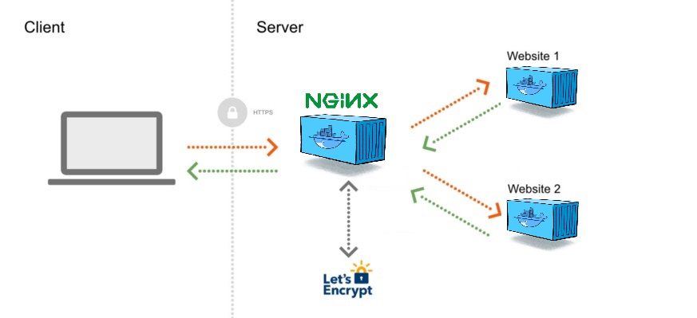
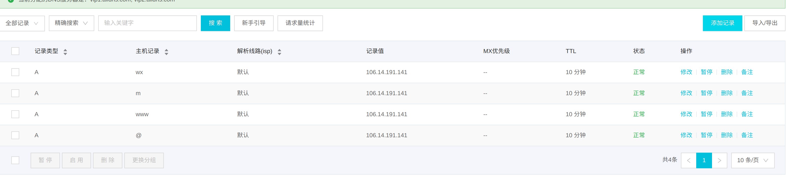
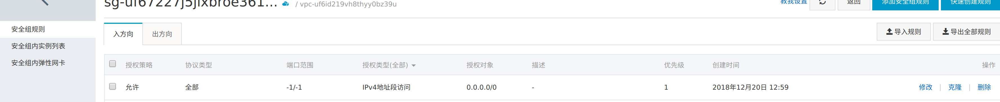
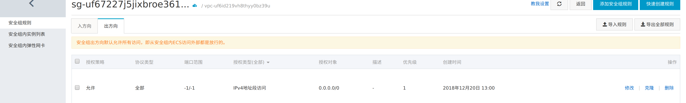

## demo環境
- aliyun服務器
- 域名https://wx.yvan.top
- docker
- https://github.com/evertramos/docker-compose-letsencrypt-nginx-proxy-companion
- https://github.com/YYvanYang/mini-app-service


## 實現： Web Proxy using Docker, NGINX and Let's Encrypt

服务器上有node服务，端口号为10030，通过docker-compose-letsencrypt-nginx-proxy-companion代理实现https://wx.yvan.top到http://0.0.0.0:10030的映射。



1. 设置域名解析


2. 服务器---管理---本实例安全组---配置规则---添加安全组规则
入方向和出方向的协议类型都设置为全部（简单方式)



3. 从github上获取docker-compose-letsencrypt-nginx-proxy-companion，并启动docker容器
4. 从github上获取mini-app-service，并启动docker容器

docker-compose.yml参考配置：
```yml
version: '3'
services:
  node:
    image: node:10.14.2
    container_name: ${NODE_SERVER_CONTAINER_NAME}
    user: "node"
    working_dir: /home/node/app
    environment:
      - NODE_ENV=production
      - VIRTUAL_HOST=${DOMAINS}
      - LETSENCRYPT_HOST=${DOMAINS}
      - LETSENCRYPT_EMAIL=${LETSENCRYPT_EMAIL}
    restart: unless-stopped
    ### IMPORTANT
    # Expose ports without publishing them to the host machine - they’ll only be accessible to linked services. Only the internal port can be specified.
    expose:
      - "10030"
    volumes:
      - ./:/home/node/app
    command: "npm start"
    depends_on:
      - redis
  redis:
    image: redis

networks:
  default:
    external:
      name: ${NETWORK}
```